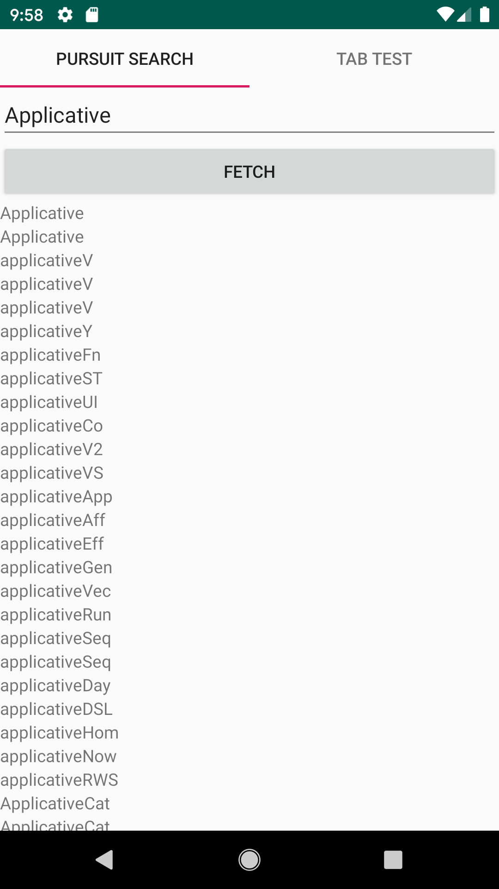

Structure
========

- pskt : Contains the PureScript files and can be build using `spago`
- app/src/main/java/ps : Contains the transpiled files from `pskt`
- app/src/main/java/ps/foreigns : Contains the foreign files, that were imported 


Build
=====

```bash
# get ffi files
$ git clone https://github.com/csicar/pskt-foreigns app/src/main/java/foreigns

# build PS
cd pskt
spago build -- --codegen corefn && pskt
```

now you can build for android project in android studio

What is does
============

The app searches pursuit for the provided query and displays the results. Clicking on one of them opens the pursuit page in the browser

The example program searches pursuit for the given search term and displays the results


